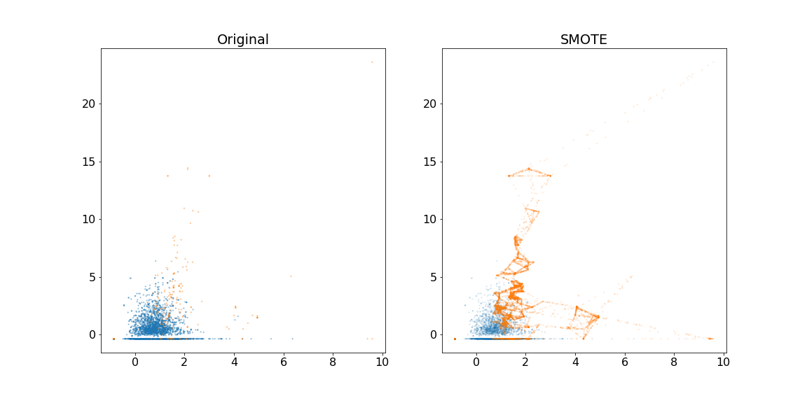
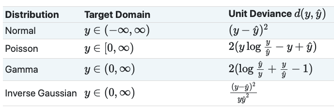

title: Advanced Machine Learning with scikit-learn: Text Data, Imbalanced Data, and Poisson Regression
use_katex: True
class: title-slide

# Advanced Machine Learning with scikit-learn
## Text Data, Imbalanced Data, and Poisson Regression


.larger[Thomas J. Fan]<br>
@thomasjpfan<br>
<a href="https://www.github.com/thomasjpfan" target="_blank"><span class="icon icon-github icon-left"></span></a>
<a href="https://www.twitter.com/thomasjpfan" target="_blank"><span class="icon icon-twitter"></span></a>
<a class="this-talk-link", href="https://github.com/thomasjpfan/ml-workshop-advanced" target="_blank">
This workshop on Github: github.com/thomasjpfan/ml-workshop-advanced</a>

---

name: table-of-contents
class: title-slide, left

# Table of Contents

1. [Text Data](#text)
1. [Imbalanced Data](#imbalanced)
1. [Poisson Regression](#poisson)

---

name: text
class: chapter-slide

# 1. Text Data

.footnote-back[
[Back to Table of Contents](#table-of-contents)
]

---

# Types of text data

<table border="1" class="dataframe">
  <thead>
    <tr style="text-align: right;">
      <th></th>
      <th>fullName</th>
      <th>country</th>
      <th>politicalGroup</th>
      <th>nationalPoliticalGroup</th>
    </tr>
  </thead>
  <tbody>
    <tr>
      <th>0</th>
      <td>Magdalena ADAMOWICZ</td>
      <td>Poland</td>
      <td>Group of the European People's Party (Christian Democrats)</td>
      <td>Independent</td>
    </tr>
    <tr>
      <th>1</th>
      <td>Asim ADEMOV</td>
      <td>Bulgaria</td>
      <td>Group of the European People's Party (Christian Democrats)</td>
      <td>Citizens for European Development of Bulgaria</td>
    </tr>
    <tr>
      <th>2</th>
      <td>Isabella ADINOLFI</td>
      <td>Italy</td>
      <td>Non-attached Members</td>
      <td>Movimento 5 Stelle</td>
    </tr>
    <tr>
      <th>3</th>
      <td>Matteo ADINOLFI</td>
      <td>Italy</td>
      <td>Identity and Democracy Group</td>
      <td>Lega</td>
    </tr>
    <tr>
      <th>4</th>
      <td>Alex AGIUS SALIBA</td>
      <td>Malta</td>
      <td>Group of the Progressive Alliance of Socialists and Democrats in the European Parliament</td>
      <td>Partit Laburista</td>
    </tr>
  </tbody>
</table>


---

# Text data we are considering

I've just had the evidence that confirmed my suspicions. A bunch of kids, 14 to 22 put on the DVD of "Titanic" on a fantastic state of the art mega screen home entertainment type deal. Only two of them had actually seen it before. But they all had seen the moment of Kate, Leo and Celine Dion so many times that most of them felt they had seen the whole movie. Shortly after the epic started, they started to get restless, some of them left asking the others

This independent, B&W, DV feature consistently shocks, amazes and amuses with it's ability to create the most insane situations and then find humor and interest in them. It's all hilarious and ridiculous stuff, yet as absurd as much of the film should be, there is a heart and a reality here that keeps the film grounded, keeps the entire piece from drifting into complete craziness and therein lies the real message here.

---

# Bag of words

.center[

]

---

# Text processing in scikit-learn

```py
from sklearn.feature_extraction.text import CountVectorizer

sample_text = ["Can we go to the mountain tomorrow?",
               "The mountain is really tall"]

vect = CountVectorizer()
vect.fit(sample_text)

vect.get_feature_names()
# ['be', 'can', 'careful', 'finished', 'go', 'hill', 'homework', 'is', 'my',
# 'please', 'tall', 'the', 'to', 'very', 'we']

X = vect.transform(sample_text)
X.toarray()
# array([[0, 1, 0, 1, 1, 1, 1, 0, 1, 0, 0, 1, 1, 0, 1],
#        [1, 0, 1, 0, 0, 1, 0, 1, 0, 1, 1, 1, 0, 1, 0]])
```

---

class: chapter-slide

# Notebook 📓!
## notebooks/01-text-data.ipynb

---

# N-grams

- Tries to keep words together
- "really tall" and "not tall" has different contexts


---

class: chapter-slide

# Notebook 📓!
## notebooks/01-text-data.ipynb

---

# Tf-idf rescaling

$$
\text{tf-idf}(t, d) = tf(t, d) \cdot \text{idf}(t)
$$
$$
\text{idf}(t) = \text{log}\frac{1 + n_d}{1 + \text{df}(d, t)} + 1
$$

- $\text{tf}(t, d)$ = The count of term $t$ in document $d$.
- $n_d$ = total number of documents
- $\text{df}(d, t)$ = number of documents containing term $r$

- scikit-learn divides each row by its length (L2 normalization)

```py
from sklearn.feature_extraction.text import TfidfVectorizer
```

---

class: chapter-slide

# Notebook 📓!
## notebooks/01-text-data.ipynb

---

name: imbalanced
class: chapter-slide

# 2. Imbalanced Data

.footnote-back[
[Back to Table of Contents](#table-of-contents)
]

---

class: middle

# What is imbalanced data?

- Cost are different between classes
- Data is imbalanced
- Some datasets have very few positive classes

---

# Different Cost between classes

.g[
.g-8[
.smaller-x[
```py
y_pred = log_reg.predict(X_test)
print(classification_report(y_test, y_pred))
```

```
              precision    recall  f1-score   support

       False       0.99      1.00      0.99      2731
        True       0.75      0.37      0.49        65

    accuracy                           0.98      2796
   macro avg       0.87      0.68      0.74      2796
weighted avg       0.98      0.98      0.98      2796
```

```py
y_pred_20 = log_reg.predict_proba(X_test)[:, 1] > 0.25
print(classification_report(y_test, y_pred_20))
```

```
              precision    recall  f1-score   support

       False       0.99      0.99      0.99      2731
        True       0.63      0.55      0.59        65

    accuracy                           0.98      2796
   macro avg       0.81      0.77      0.79      2796
weighted avg       0.98      0.98      0.98      2796
```
]
]
.g-4[
$$
\text{precision} = \frac{TP}{TP + FP}
$$

$$
\text{recall} = \frac{TP}{TP + FN}
$$
]
]

---

class: chapter-slide

# Notebook 📕!
## notebooks/02-imbalanced-data.ipynb

---

# Resampling


---

# sklearn Pipelines - Unable to handle sampling


---

# Imbalanced-learn

[https://imbalanced-learn.org/stable/](https://imbalanced-learn.org/stable/)

- Extends scikit-learn API
- Defines samplers

## Defines pipeline to handle sampling

```py
from imblearn.pipeline import make_pipeline as make_imb_pipeline

from imblearn.under_sampling import RandomUnderSampler
from imblearn.over_sampling import RandomOverSampler
```

---

# Sampler Objects

To resample a dataset:

```py
data_resampled, targets_resampled = obj.sample(data, targets)
```

Fitting and sampling done in one line:

```py
data_resampled, targets_resampled = obj.fit_sample(data, targets)
```

---

class: chapter-slide

# Notebook 📕!
## notebooks/02-imbalanced-data.ipynb

---

# Class-weights

- Re-weight the loss functions
- Native to scikit-learn for most models
- Same effect as over-sampling, but keeps the dataset size the same

---

# Class-weights
## Linear models

- Loss of a given sample is weighted inversely proportional to class frequencies

```py
LogisticRegression(class_weight='balanced')
```

## Tree models

- When deciding where to split, the `criterion` is weighted inversely proportional to class frequencies

```py
DecisionTreeClassifier(class_weight='balanced')
```

---

class: chapter-slide

# Notebook 📕!
## notebooks/02-imbalanced-data.ipynb

---

class: middle

# Balanced Bagging

- Random under sampling for each instance in the ensemble

```py
from imblearn.ensemble import BalancedRandomForestClassifier

balanced_rf = BalancedRandomForestClassifier(random_state=0)
balanced_rf.fit(X_train, y_train)
```

---

class: chapter-slide

# Notebook 📕!
## notebooks/02-imbalanced-data.ipynb

---

# Synthetic Minority Oversampling Technique
## SMOTE

- Adds synthetic interpolated data to the minority class
- For each sample in minority class:
    - Pick random neighbor from k neighbors.
    - Pick point on line connecting the two uniformly

---

# Generated Data with SMOTE



---

class: chapter-slide

## Notebook 📕!
### notebooks/02-imbalanced-data.ipynb

---

name: poisson
class: chapter-slide

# 3. Poisson Regression

.footnote-back[
[Back to Table of Contents](#table-of-contents)
]

---

# Generalized Linear Models

Predicted values $\hat{y}$ are linked to a linear combination of $X$ via an
inverse link function:

$$
\hat{y}(w, X) = h(Xw)
$$

The minimization problem becomes:

$$
\min_{w}\frac{1}{2n}\sum_i d(y_i, \hat{y}_i) + \frac{\alpha}{2} ||w||_2
$$

- $n$ is the number of samples
- $\alpha$ is the L2 regularization penalty,
- $d(y_i, \hat{y}_i)$ is the unit deviance

---

# Unit Deviances




---

class: middle

# Scikit-learn supports GLMS!

`TweedieRegressor` implements GLM for the Tweedie distribution with a `power` parameter
```py
from sklearn.linear_model import TweedieRegressor
```

`power=0`: Normal distribution: Use `Ridge`, `ElasticNet`, etc.

---

class: middle

# Convenience estimators GLM

Same as `TweedieRegressor(power=1, link='log')`
```py
from sklearn.linear_model import PoissonRegressor
```

Same as `TweedieRegressor(power=2, link='log')`
```py
from sklearn.linear_model import GammaRegressor
```

---

# Examples of use cases for GLMS

- Agriculture / weather modeling:
    - number of rain events per year (Poisson)
    - amount of rainfall per event (Gamma)

- Risk modeling / insurance policy pricing:
    -  number of claim events / policyholder per year (Poisson)
    - cost per event (Gamma)

- Predictive maintenance:
    - number of production interruption events per year (Poisson)
    - duration of interruption (Gamma)

---

class: chapter-slide

# Notebook 📘!
## notebooks/03-poisson-regression.ipynb

---

class: title-slide, left

# Closing

.g.g-middle[
.g-7[

1. [Text data](#text)
1. [Imbalanced Data](#imbalanced)
1. [Poisson Regression](#poisson)
]
.g-5.center[
<br>
.larger[Thomas J. Fan]<br>
@thomasjpfan<br>
<a href="https://www.github.com/thomasjpfan" target="_blank"><span class="icon icon-github icon-left"></span></a>
<a href="https://www.twitter.com/thomasjpfan" target="_blank"><span class="icon icon-twitter"></span></a>
<a class="this-talk-link", href="https://github.com/thomasjpfan/ml-workshop-advanced" target="_blank">
This workshop on Github: github.com/thomasjpfan/ml-workshop-advanced</a>
]
]
